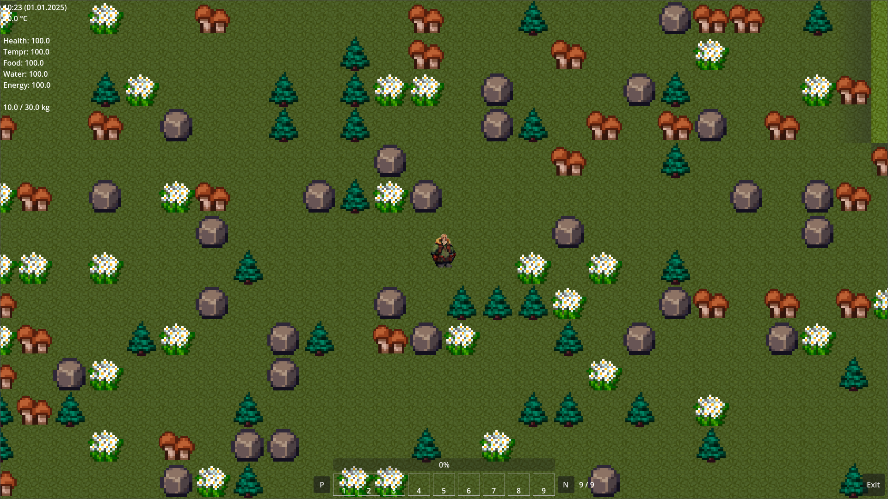
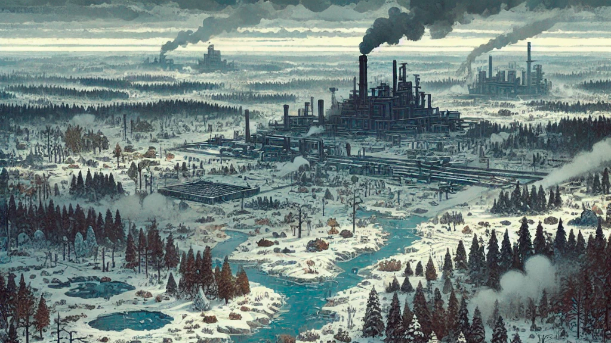
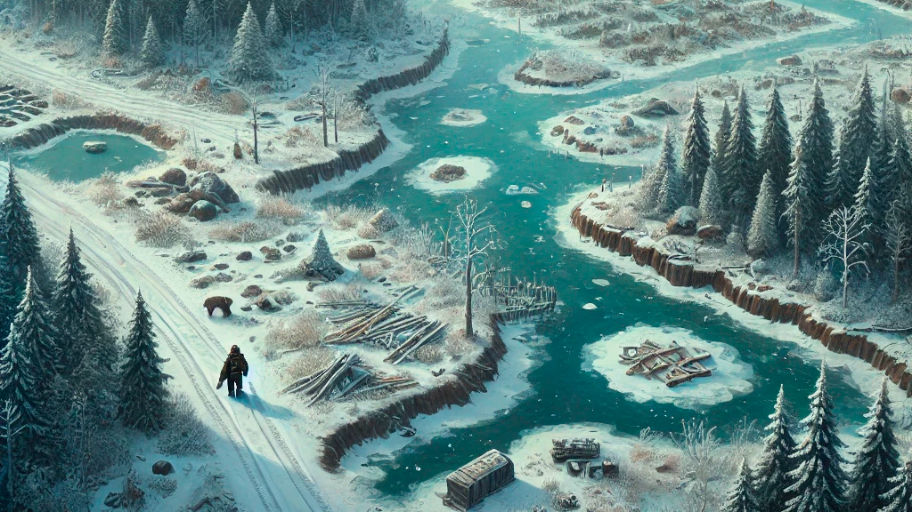
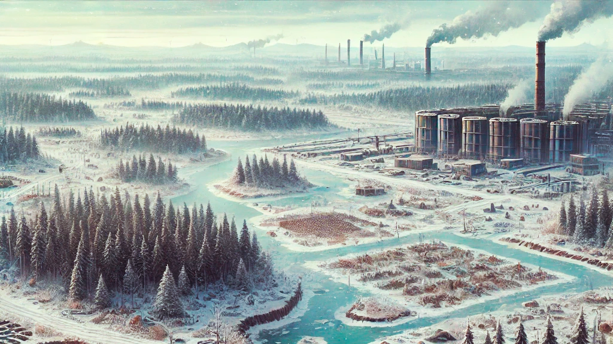
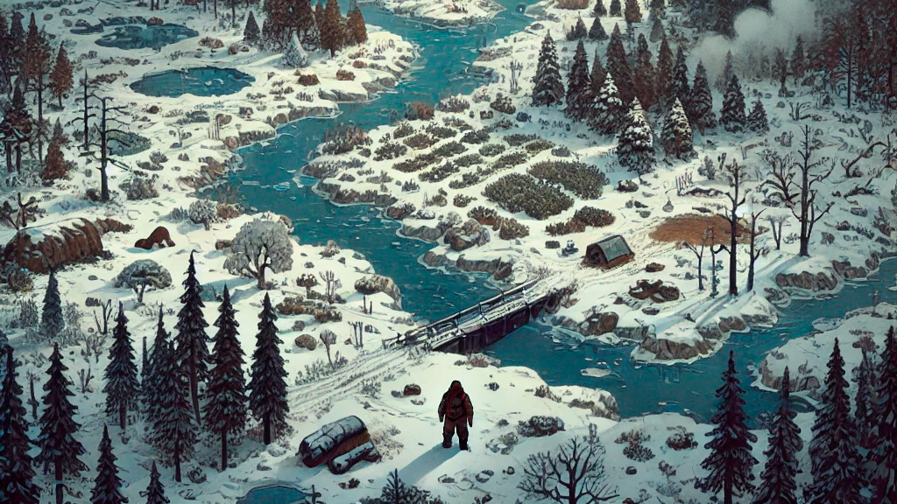
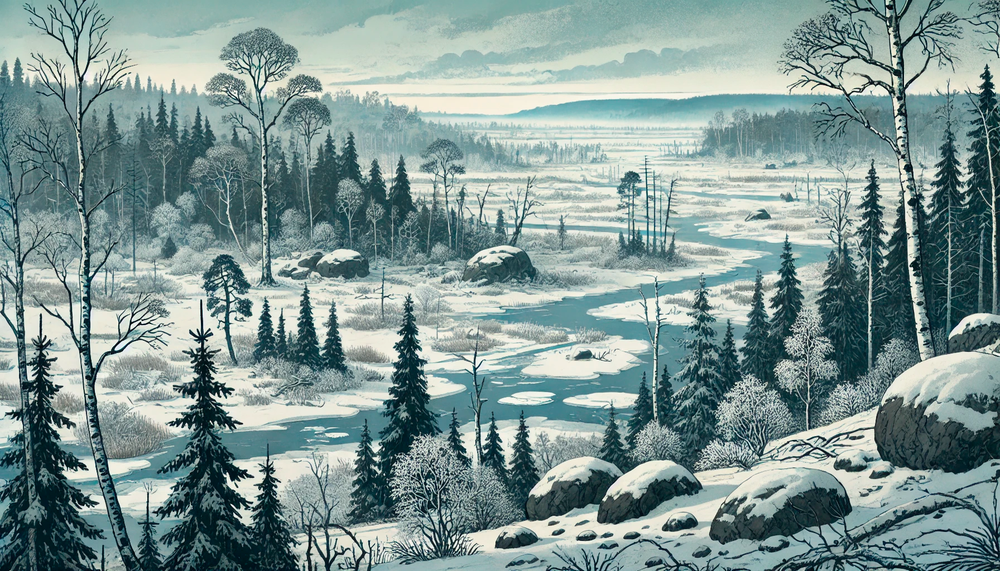
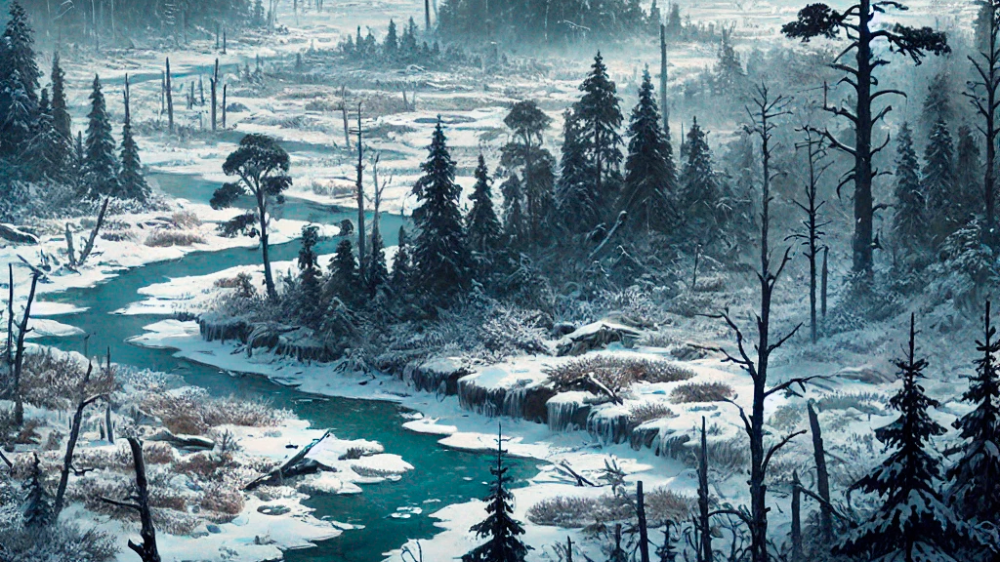
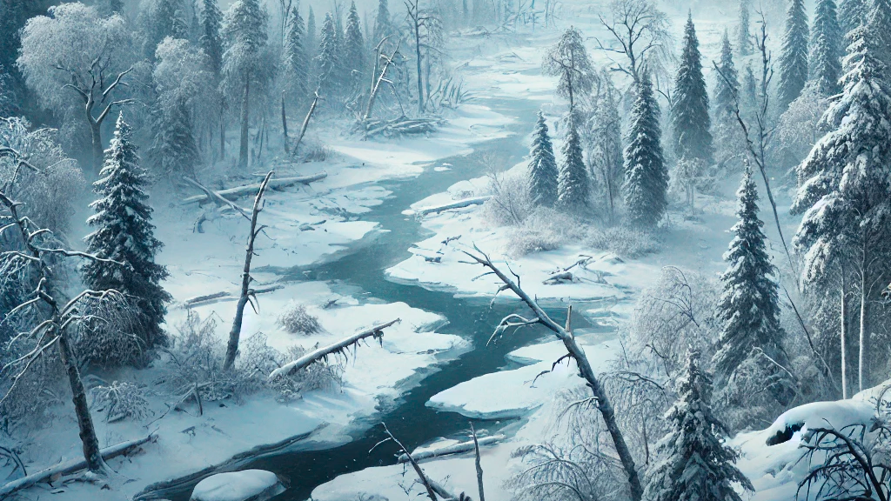
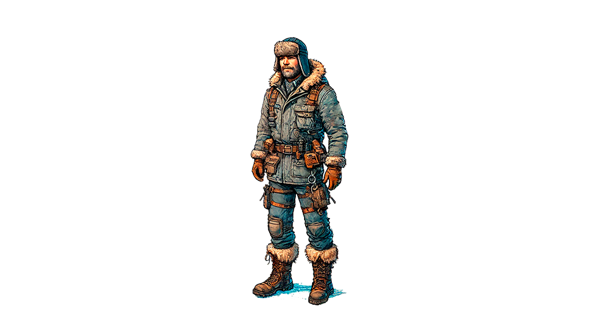

# Концепт-арты игры UTech: The Siberian Mystery

- [Основное меню](./README.md)

## Сеттинг

*Лагерь с видом на электростанцию и вышку связи*

*Нефтеперерабатывающий завод в долине*

*Дорога вдоль реки*

*Завод по обогащению ядерного топлива*

*Оазис жизни в ледяной пустоши*

## Природа

*Река и долина*

*Лес на берегу реки*

*Замерзшее болото*

*Зимняя стужа*

## Мир

*Игровой мир*

## Персонаж

*Главный персонаж в теплой одежде*

---
© 2024 Вадим Бельский (bielski.vadim@gmail.com)