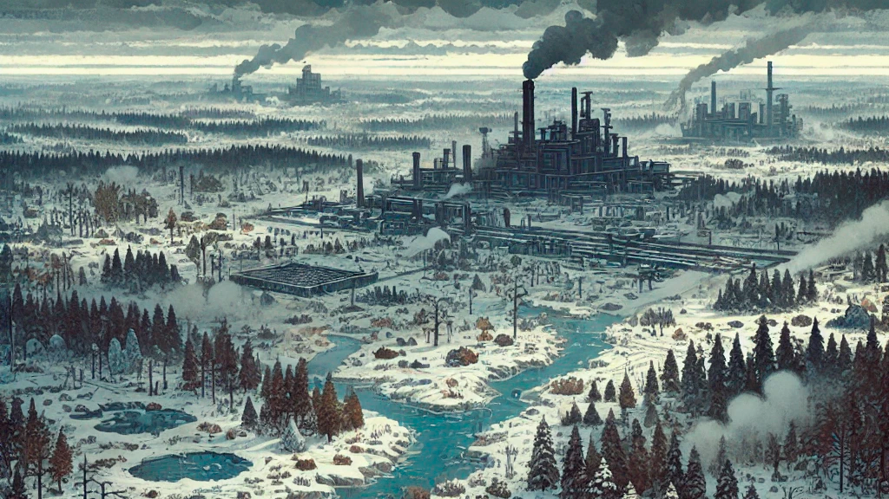
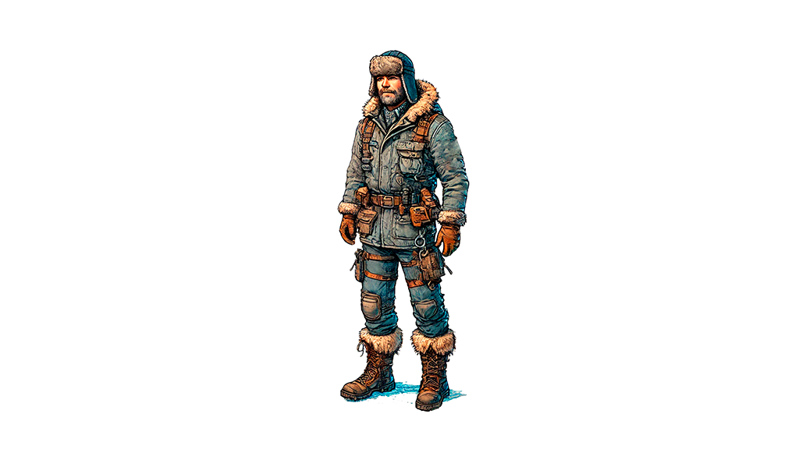

# Описание игры

- [Основное меню](./README.md)

## Игра

Игра представляет собой 2D песочницу с видом сверху, где игроку, подобно игре Factorio, необходимо управлять одним персонажем, за которого предстоит исследовать мир, добывать ресурсы, создавать различные предметы и строить механизмы и комплексные промышленные объекты. 

Игровой мир является бесконечным и процедурно генерируемым, и, подобно игре Dwarf Fortress, разделён на уровни. Система строительства позволит сильно терраформировать мир.

Разнообразие предметов и механизмов и комплексность процесса их создания схожа с GregTech и TerraFirmaCraft.

В игре есть система выживания, напоминающая систему выживания из The Long Dark, где игроку предстоит следить за голодом, жаждой, усталостью и температурой, чтобы поддерживать состояние персонажа на нормальном уровне.

*Концепт арт игры*

## Сеттинг

Действие происходит в реальном мире, на Земле, в труднодоступной части центральной Сибири, где идет бесконечная суровая зима, а фауна полна опасных диких животных.

В игре присутствуют реалистичные материалы, реалистичные технологии, реалистичные математические модели механизмов и технологических процессов. Магии и технологий или материалов из научной фантастики в игре не будет. 

*Концепт арт игры*

## Цель игры

Условной целью игры является создание автоматизированного завода по переработке всех доступных в игре видов природных ресурсов и изготовлению из них обширного списка высокотехнологического оборудования, необходимого для создания промышленной инфраструктуры для реализации замкнутого ядреного топливного цикла.

Так как игра является песочницей, то не имеет какого-либо ограничивающего игру фактора, продолжать выживать в мире и развиваться можно бесконечно.

Игра будет иметь книгу заданий, целью которой будет познакомить игрока со всем основным контентом игры. Формальным окончанием игры будет выполнение всех квестов.

*Концепт арт игры*

## Игровой процесс

Игроку предстоит исследовать игровой мир в поисках источников пищи и воды, а также полезных ископаемых и других необходимых для выживания и строительства производства ресурсов. Игроку предстоит добывать ресурсы и перерабатывать их в полезные материалы и инструменты, строить различные механизмы, станки и другое оборудование для автоматизации процесса добычи и переработки ресурсов, создавать высокотехнологичное оборудование для создания комплексных технологических процессов, настраивать системы автоматического управления созданным производством. При этом, игроку необходимо следить за состоянием персонажа, поддерживая его параметры на нормальном уровне, поскольку игроку постоянно угрожает суровые погодные условия, а также дикие животные. 

*Концепт арт игры*

Игра не содержит формальных технологий, которые надо открывать подобно Factorio или Satisfactory, вместо этого прогресс игрока определяется инфраструктурой, которую он построил. Получение доступа к более продвинутым материалам и механизмам становится доступным с появлением определенных механизмов предыдущего уровня, подобно тому как это реализовано в GregTech.

В начале игры персонаж выполняет всю работу сам, со временем труд начинает механизироваться с появлением механических, а затем паровых машин. На определенном этапе появляется возможность строить автоматизированные цепочки для переработки ресурсов и создания из этих ресурсов необходимых предметов. Вначале добычу ресурсов предстоит вести вручную с использованием простых инструментов, далее с применением паровых, бензиновых и электрических механизмов для повышения производительности труда на поздних этапах игры с применением автоматизированных дронов.

На начальном этапе предстоит собирать легкодоступные ресурсы, построить простое убежище, собирать ягоды и грибы, вести охоту на мелкую дичь и ловить рыбу, чтобы не умереть от голода. Найти источник чистой воды, и развести огонь, чтобы согреться ночью, и осветить местность вокруг себя, так как ночью без искусственных источников освещения не видно ничего. Игроку предстоит регулярно добывать дрова, чтобы греться ночью, до тех пор, пока он не обзаведется теплой одеждой или не построит систему отопления.

*Концепт арт игры*

Изначально игроку, доступны только простые природные материалы, такие как травы, валежник, небольшие камни, туши мертвых животных. Из этого предстоит создать первые инструменты и построить первые приспособления для обработки простых материалов. Каменные инструменты позволят рубить большие деревья и обрабатывать древесину, чтобы построить базовое жилище. Далее игрок получает доступ к глине и изготовлению из нее изделий для работы с медью, оловом и бронзой. Бронзовые инструменты позволяют заниматься горным делом, и добывать богатую железом породу. После освоения железа, можно освоить изготовление стали, которая необходима для изготовления прочных инструментов и механизмов. На начальном этапе, игрок может создавать только механизмы работающие на механической тяге, от ручного привода, с освоением металлов становятся доступны водяные и ветряные колеса, для примитивной механизации труда. После освоения бронзы и стали появляется возможность создавать паровые механизмы, которые позволят значительно облегчить и ускорить обработку материалов. После освоения стали появляется возможность создать генератор, открывая доступ к электрическим машинам и инструментам, в том числе к электролизу, которые выводит металлургию на новый уровень, открывая доступ к новым материалам. С развитием электроники появляется возможность создавать системы автоматического управления.

## Игровой мир

Действие игры разворачивается в отдалённом и труднодоступном участке Центральной Сибири, окружённый непроходимыми болотами, куда игрок был доставлен вертолётом.  

Климат в данном регионе суров, а вокруг обитает большое количество опасных хищников. Природа данного региона богата различными природными ресурсами: лесами, животными, рыбой в водоемах и полезными ископаемыми. 

Мир по своей структуре похож на мир в игре Dwarf Fortress, он разделён на уровни, которые расположены друг над другом. Это позволяет строить не только горизонтально, но и вертикально.

*Концепт арт игрового мира*

## Персонаж

Персонаж, за которого играет игрок, является мужчиной крепкого телосложения, с высшим техническим образованием, широкими знаниями о мире, технике и природе и хорошими навыками работы с различными инструментами и оборудованием. Имеет опыт туризма и выживания в дикой природе, хорошо адаптируется к холодам, умеет хорошо ориентироваться на местности и обладает хорошей памятью. 

Игроку необходимо следить за основными параметрами здоровья персонажа, такими как голод, жажда, усталость, температура, которые влияют на общее состояние здоровья персонажа, иначе персонаж может умереть. В случае смерти персонажа, у игрока есть возможность отправиться в этот мир новым персонажем, чтобы продолжить экспедицию. 

Персонаж имеет систему навыков, которые можно развивать. Навыки необходимы для того, чтобы было жалко терять персонажа с развитыми навыками, стимулируя игрока бороться за его жизнь до конца. Влияние навыков персонажа на геймплей должно быть таковым, чтобы персонажа было жаль потерять, но при этом его гибель не стала бы основной причиной забросить этот игровой мир.

*Концепт арт персонажа*

## Визуальный стиль

Игра имеет pixel-art графику с разрешением 32x32 пикселя на тайл. Стиль графики схож с Stoneshard. 

---
© 2024 Вадим Бельский (bielski.vadim@gmail.com)