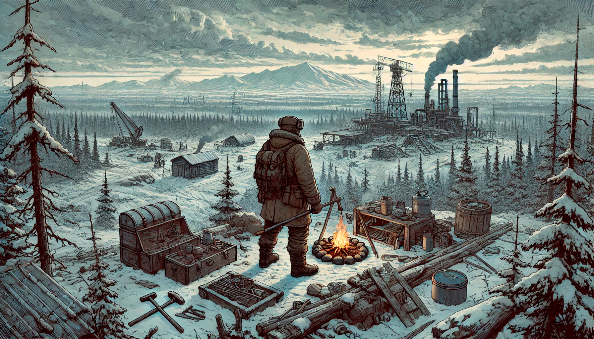

# UTech: The Siberian Mystery

2D песочница с видом сверху, в которой игроку предстоит взять на себя роль инженера и возглавить исследовательскую экспедицию в отдаленный уголок Сибири для освоения труднодоступной части Васюганского болота, где в экстремальных условиях необходимо с нуля построить крупный промышленный объект, пройдя путь от примитивного выживания в дикой природе и добычи простых природных материалов, до создания комплексных автоматизированных промышленных цепочек по добыче и переработке ресурсов с целью создания замкнутого ядерного топливного цикла.

## Платформы

- Desktop (Windows, Linux)

## Инструменты

- Godot Engine 4.3, C#

## Жанры

- Симулятор строительства и управления
- Симулятор выживания
- Песочница

## Референсы

| Игра                     | Элементы                                                        |
| ------------------------ | --------------------------------------------------------------- |
| Core Keeper              | Управление персонажем, взаимодействие с миром, боевая система |
| GregTech и TerraFirmaCraft | Комплексность рецептов, разнообразие механизмов                 |
| Factorio и Satisfactory   | Масштабность производства                                       |
| The Long Dark            | Система выживания                                               |
| Dwarf Fortress           | Мир, разделенный на уровни                                      |
| Stoneshard               | Визуальный стиль                                                |

## Разделы

- [Описание игры](./Description.md)
- [Концепт арты](./ConceptArts.md)
- [Мир](./Features/World.md)
- [Управление персонажем](./Features/CharacterControlSystem.md)
- [Система выживания](./Features/SurvivalSystems.md)
- [Предметы](./Features/Items.md)
- [Крафт](./Features/CraftSystem.md)
- [Моделирование и механизмы](./Features/ModelingSystem.md)
- [Моддинг](./Features/Modding.md)

## Контакты

- [bielski.vadim@gmail.com](mailto:bielski.vadim@gmail.com)
- [Ссылка на группу VK](https://vk.com/utech)

---
© 2024 Вадим Бельский (bielski.vadim@gmail.com)