# UTech: The Siberian Mystery. Описание игры

## Общая информация об игре

### Название

UTech: The Siberian Mystery

### Жанры

Симулятор строительства и управления, симулятор выживания, песочница

### Референсы

- GregTech (модификация Minecraft)
- TerraFirmaCraft (модификация Minecraft)
- Factorio
- Satisfactory
- Space Engineers
- The Long Dark
- Don’t Starve Together
- Dwarf Fortress  

### Платформы

- Desktop (Windows 10 и старше)

### Инструменты

- Godot Engine 4.3
- C#
- GDScript
- JavaScript 

### Краткое описание

2D песочница, в которой игроку предстоит взять на себя роль инженера и возглавить исследовательскую экспедицию в отдаленный уголок Сибири для освоения труднодоступной части Васюганского болота, где в экстремальных условиях необходимо с нуля построить крупный промышленный объект, пройдя путь от примитивного выживания в дикой природе и добычи простых природных материалов, до создания комплексных автоматизированных промышленных цепочек по добыче и переработке ресурсов, для того чтобы построить всю необходимую инфраструктуру для замкнутого ядерного топливного цикла.

_Прототип игры UTech_

## Описание игры

### Общее

Игра представляет собой 2D песочницу с видом сверху, где игроку, подобно игре Factorio, необходимо управлять одним персонажем, за которого предстоит исследовать мир, добывать ресурсы, создавать различные предметы и строить промышленные объекты. 

_Референс: Factorio_ 

Игровой мир является бесконечном процедурно генерируемым, а также, подобно игре Dwarf Fortress состоит из слоев и может быть полностью изменен.

Разнообразие предметов и механизмов, и комплексность процесса их создания схожа с GregTech и TerraFirmaCraft (моды для Minecraft).

В игре есть система выживания, напоминающую систему выживания из The Long Dark, где игроку предстоит следить за голодом, жаждой, усталостью и температурой, чтобы поддерживать состояние персонажа на нормальном уровне.

Игра имеет широкие возможности для модификации путём создания пользовательских контент паков содержащих скрипты на JavaScript и игровые асеты.  

### Сеттинг

Действие происходит в реальном мире, на Земле, в труднодоступной части центральной Сибири.

В игре присутствуют реалистичные материалы, реалистичные технологии, реалистичные математические модели механизмов и технологических процессов. Магии и технологий или материалов из научной фантастики в игре не будет.

Мир игры обладает суровым климатом с долгой морозной зимой и коротким холодным летом, а фауна полона опасных диких животных. 

_Референс: Природа_ 

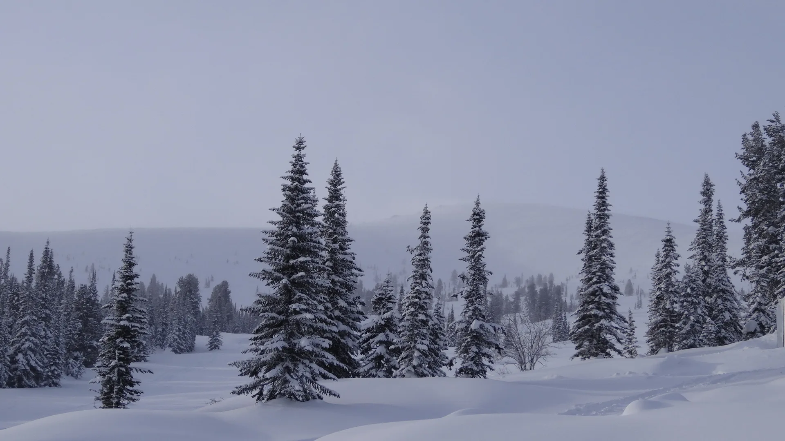

### Цель игры

Условной целью игры является создание автоматизированного завода по переработки всех доступных в игре видов природных ресурсов и изготовлению из них обширного списка высокотехнологического оборудования, необходимого для создания промышленной инфраструктуры для реализации замкнутого ядреного топливного цикла.

Так как игра является песочницей, то не имеет какого-либо ограничивающего игру фактора, продолжать выживать в мире и развиваться можно бесконечно.

Игра будет иметь книгу заданий, подобно тому, как это реализовано в модификациях для Minecraft, целью которой будет познакомить игрока со всем основным контентом игры, формальным окончанием игры будет выполнение всех квестов.

_Референс: Книга квестов_ 

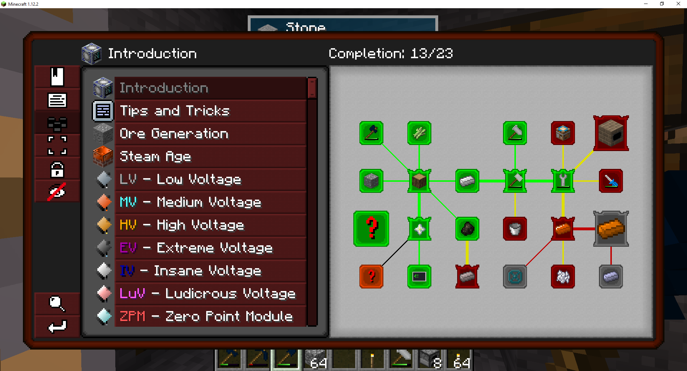

### Визуальный стиль

Стиль игры схож Dwarf Fortress. Игра имеет пиксельную графику для тайлов и предметов с разрешением текстур в 32 пикселя на тайл.

_Референс: Dwarf Fortress_ 

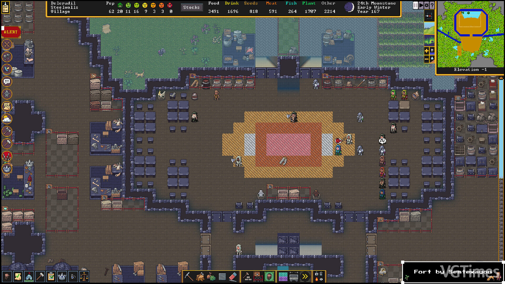
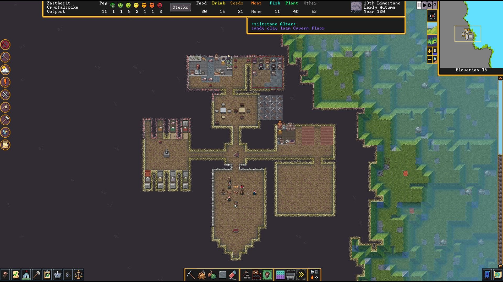
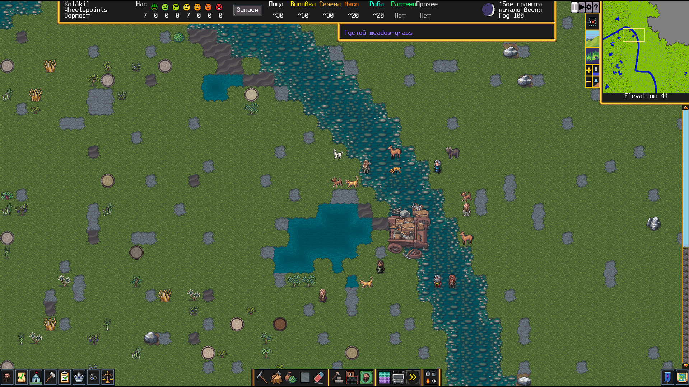
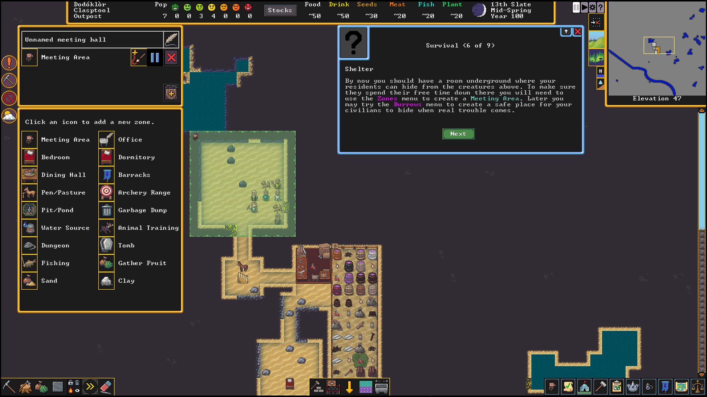
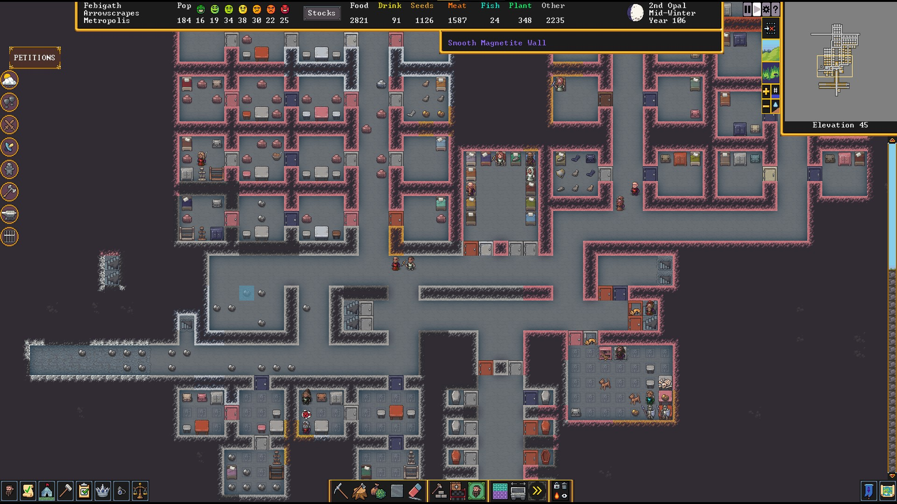
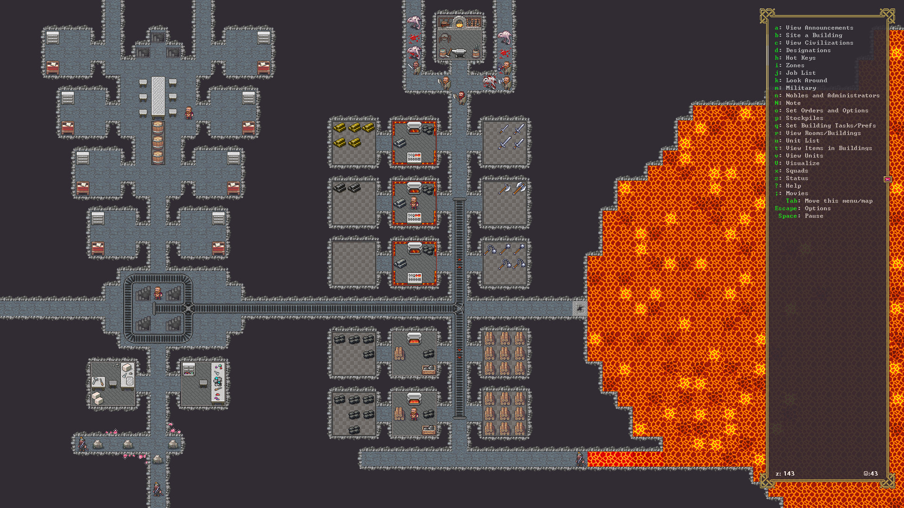
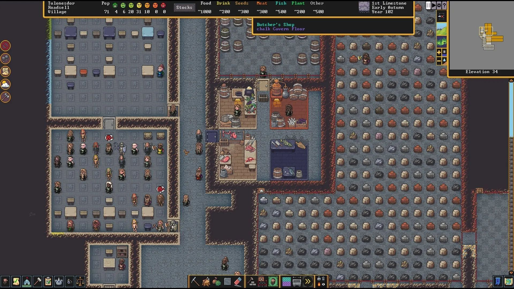

## Игровой процесс

### Основные элементы игрового процесса

Игроку предстоит исследовать игровой мир в поисках источников пищи и воды, а также полезных ископаемых и других необходимых для выживания и строительства производства ресурсов. Игроку предстоит добывать ресурсы и перерабатывать их в полезные материалы и инструменты, строить различные механизмы, станки и другое оборудования для автоматизации процесса добычи и переработки ресурсов, создавать высокотехнологичное оборудование для создания комплексных технологических процессов, настраивать системы автоматического управления созданным производством. При этом, игроку необходимо следить за состоянием персонажа, поддерживая его параметры на нормальном уровне, поскольку игроку постоянно угрожает суровые погодные условия и дикие животные. 

В начале игры персонаж выполняет всю работу сам, со временем труд начинает механизироваться с появлением механических, а затем паровых машин. На определенном этапе появляется возможность строить автоматизированные цепочки для переработки ресурсов и создания из этих ресурсов необходимых предметов.

Сначала добычу ресурсов предстоит вести в ручную с использованием ручных инструментов, далее с применением паровых, бензиновых и электрических механизмов для облегчения труда, на поздних этапах игры с применением автоматизированных дронов.

### Развитие игрового процесса

Игра не содержит формальных технологий, которые надо открывать подобно Factorio или Satisfactory, вместо этого прогресс игрока определяется инфраструктурой которую он построил, для получения доступа к более продвинутым материалам и механизмам становиться доступным с появлением определенных механизмов предыдущего уровня, подобно тому как это реализовано в GregTech (модификация для Minecraft).

В начале игры предстоит собирать легкодоступные ресурсы, построить базовое убежище, собирать ягоды и грибы, вести охоту на мелкую дичь и ловить рыбу, чтобы не умереть от голода. Найти источник чистой воды, и развести огонь, чтобы согреться ночью, и осветить местность вокруг себя, так как ночью без искусственных источников освещения не видно ничего. Игроку предстоит регулярно добывать дрова, для того чтобы согреться ночью, до тех пор, пока он не обзаведется теплой одеждой или не построит систему отопления.

_Референс: Factorio_ 

На начальном этапе игроку, доступны только легкодоступные природные материалы, такие как травы, валежник, небольшие камни, редкости встречающиеся самородки меди, туши мертвых животных. Из этого предстоит создать первые инструменты и построить первые приспособления для обработки простых материалов. Каменные инструменты позволят рубить больше деревья, и обрабатывать древесину, чтобы построить базовое жилище. Далее игрок получает доступ к глине и изготовлению из нее изделий для работы с медью, оловом и бронзой. Бронзовые инструменты позволяют заниматься горным делом, и добывать богатую железом породу. После освоения железа, можно освоить изготовление стали, которая необходима для изготовления прочных инструментов и механизмов. На начальном этапе, игрок может создавать только механизмы работающие на механической тяге, от ручного привода, с освоением металлов становятся доступны водяные и ветряные колеса, для примитивной механизации труда. После освоения бронзы и стали появляется возможность создавать паровые механизмы, которые позволят значительно облегчить и ускорить обработку материалов. После освоение базовой химии и производства каучука появляется возможность создавать изоляцию и провода, что позволяет создать генератор, открывая доступ к электрическим машинам и инструментам, в том числе к электролизу, которые выводит металлургию на новый уровень открывая доступ к новым материалам. С развитием электроники появляется возможность создавать системы автоматического управления. 

## Игровой мир

### Место действия

Действие игры разворачивается в отдалённом и труднодоступном участке Центральной Сибири, окруженный непроходимыми болотами, в который игрок был высажен с вертолёта.  

_Референс: Природа_ 

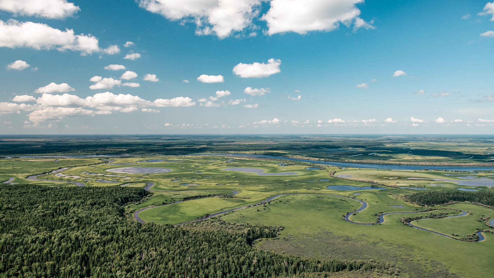

Климат в данном регионе суров, и на данной территории обитает большое количество опасных животных. Природа данного региона богата различными природными ресурсами, такими как леса, дикие животные, рыба в водоемах, различные природные ископаемые. 

_Референс: Природа_ 

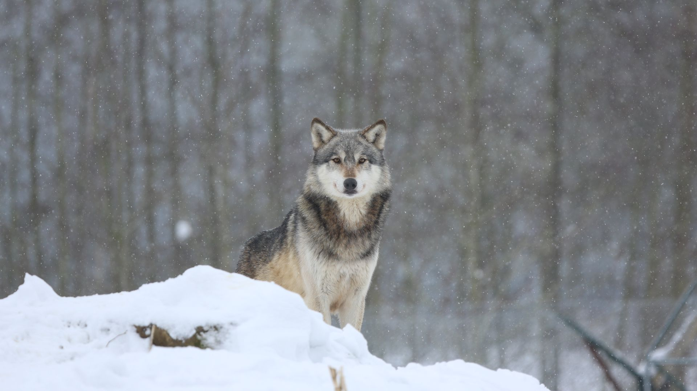

### Размер и генерация игрового мира

Мир игры является условно бесконечным, создаваемым процедурно с помощью генераторов миров, которые можно создавать и настраивать в контент паках. 

_Прототип игры UTech_

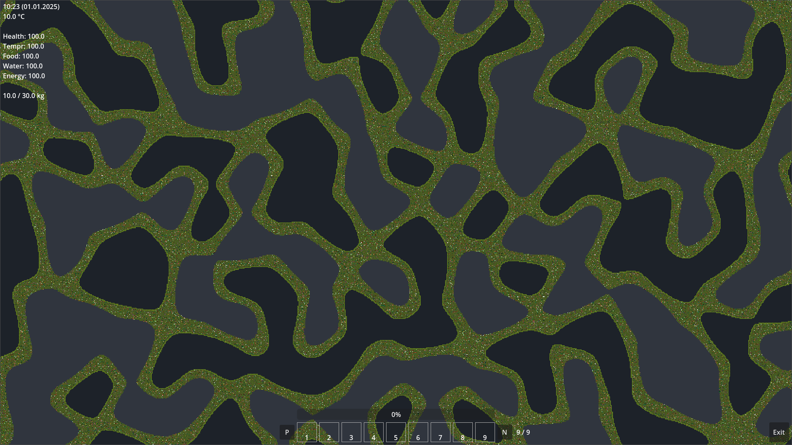

### Структура игрового мира

Мир по своей структуре похож на мир в игре Dwarf Fortress, он состоит из слоёв, расположенных друг над другом, что позволяет строить не только горизонтально, но и вертикально. Слой состоит из тайла перекрытия, расположенного между слоями и основного тайла, расположенного непосредственного на слое. Мир можно подвергать изменению, поскольку каждый тайл можно разобрать и построить снова. Игра сохраняет только изменения внесённые в игровой мир. Неизмененная информация не храниться, а процедурно генерируется каждый раз. 

_Референс: Dwarf Fortress_

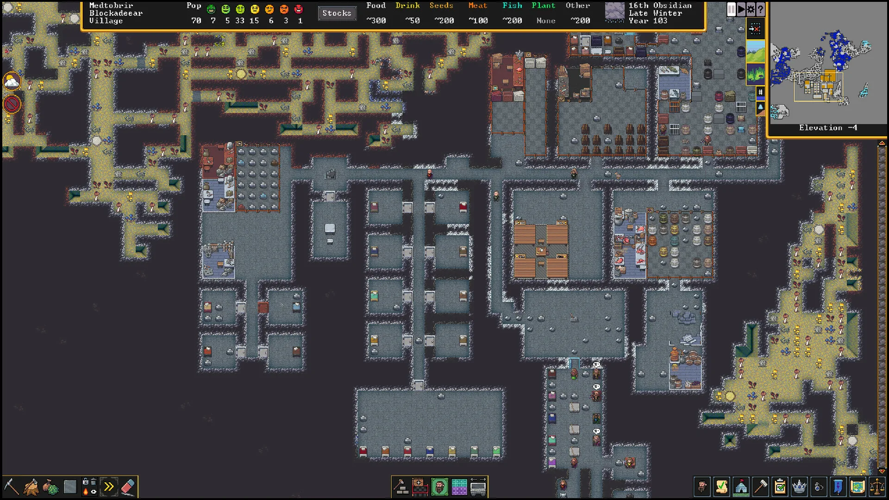

## Игровой персонаж

### Общие сведения

Персонаж, за которого играет игрок, является мужчиной крепкого телосложения, с высшим техническим образованием, широкими знаниями о мире, техники и природе, и хорошими навыками работы с различными инструментами и оборудованием. Имеет опыт туризма и выживания в дикой природе, хорошо адаптируется к холодам, умеет хорошо ориентироваться на местности и обладает хорошей памятью. 

_Концепт арт персонажа, сгенерированный нейросетью по описанию_

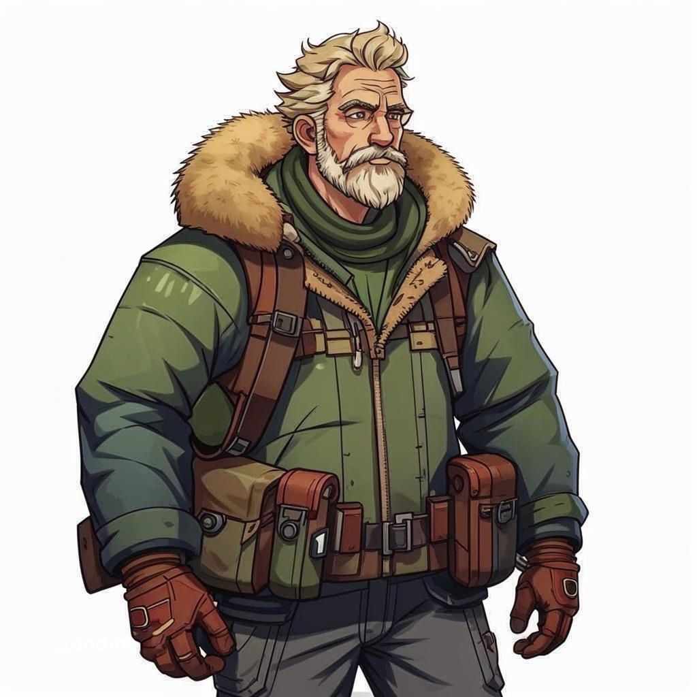

### Основные игровые механики персонажа

Игроку необходимо следить за основными параметрами здоровья персонажа, такими как голод, жажда, усталость, температура, которые влияют на общее состояние здоровья персонажа, иначе персонаж может умереть. В случае смерти персонажа, у игрока есть возможность отправиться в этот мир новым персонажем, чтобы продолжить экспедицию. 

Персонаж имеет систему навыков, которые можно развивать. Навыки необходимы для того, чтобы было жалко терять персонажа с развитыми навыками, стимулируя игрока бороться за его жизнь персонажа до конца. Влияние навыков персонажа на геймплей должно быть таковым, чтобы персонажа было жалко потерять, но при этом его гибель не стала бы основной причиной забросить этот игровой мир.

### Управление персонажем

Система управления персонажем схожа с игрой Factorio, управление производиться стандартными клавишами движения, камера с видом сверху следует за персонажем. Персонаж может свободно перемещаться по миру и взаимодействовать с ним.

_Референс: Factorio_ 

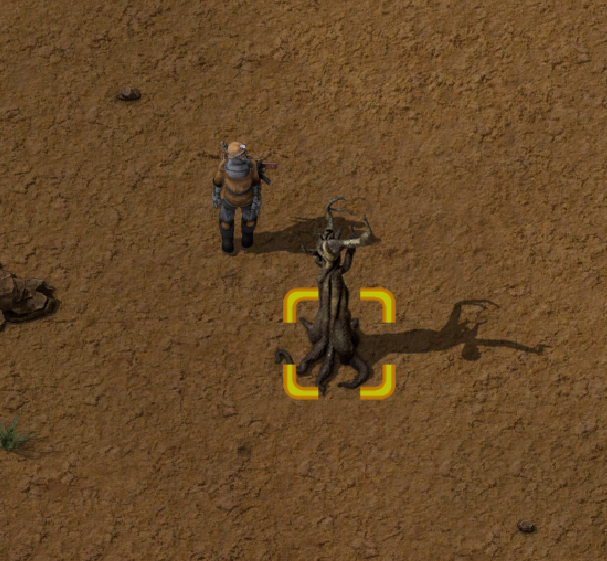
 
## Основные игровые механики

### Предметы и крафты

Предметы обладают различными свойствами, такими как масса, температура, физическое состояние и рядом других физических и химических характеристик и располагаются в хранилищах, привязанных к сущностям, будь то игрок, предмет или механизм. Хранилище имеет ограничение на разнообразие и количество предметов, которые могут быть в него помещены.

_UTech - ранний прототип_

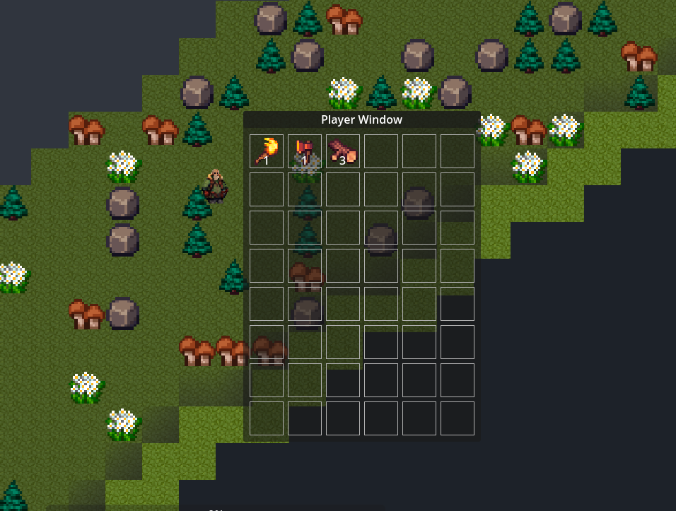

Система крафтов напоминает систему крафтов в Factorio или Satisfactory, однако является более глубокой и подробной, подобно тому как это реализовано в GregTech и TerraFirmaCraft (модификациях для Minecraft), обеспечивая вариативность в создании чего-либо, чтобы перед игроком постоянно стоял выбор и задача по поиску компромисса, подобно тому как это сделано в GregTech.

На начальном этапе все крафты выполняются вручную персонажем, однако со временем всё больше крафтов начинает переходить на какие-либо станки (механизмы) для повышения производительности труда, а со временем, выполнение крафтов начинает автоматизироваться, постепенно требуя всё меньше внимания игрока.

_UTech - ранний прототип_

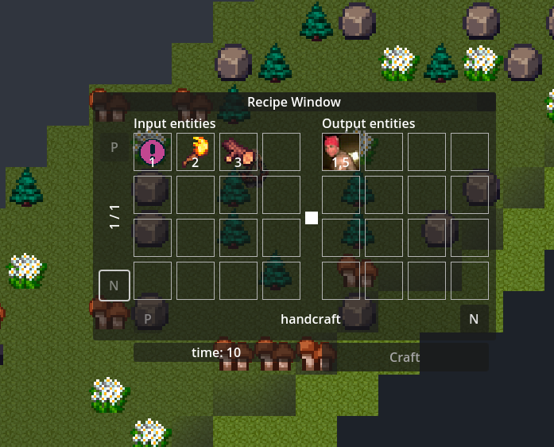

### Игровая механика выживания персонажа 

Механика выживания похожа на аналогичную из The Long Dark. Персонаж обладает следующими параметрами, которые необходимо поддерживать на приемлемом уровне.

|Параметр|Описание|
|-|-|
| Health | Снижается под действием негативных эффектов. Восстанавливается со временем, во сне скорость восстановления ускоряется. Снижение приводит к наложению негативных эффектов и гибели персонажа |
| Food | Снижается со временем. Восстанавливается при потреблении пищи. Снижение приводит к наложению негативных эффектов |
| Water | Снижается со временем. Восстанавливается при потреблении воды. Снижение приводит к наложению негативных эффектов |
| Energy | Снижается со временем. Восстанавливается во время сна. Снижение приводит к наложению негативных эффектов |
| Temperature | Изменяется под действием температуры окружающей среды. Снижение приводит к наложению негативных эффектов |
| Переносимый вес | Максимальный переносимый вес персонажа ограничен. При превышении, скорость перемежения персонажа снижается до тех пор, пока она не потеряется возможность перемещаться |

## Модификации и пользовательские наборы контента

### Контент паки

Весь контент игры описан в контент паках. Игра содержит нативные контент паки от разработчика, а также предусматривает возможность создания пользовательских контент паков (модификаций).

Контент паки состоят из скриптов и асетов. Скрипты пишутся на языке JavaScript, и описывают свойства предметов, тайлов, рецепты, генераторы миров, а также слова переводов для локализации игры. Асеты содержат текстуры, готовые пресеты игровых объектов и пользовательского интерфейса, а также другие необходимые для игры ресурсы. Контент паки имеют систему зависимостей и версий, предназначенную для проверки целостности игровой сборки, а так же управляющую порядком загрузки контент паков. Игра должна дать сообществу глубокую возможность по модификации, для создания разнообразных пользовательских наборов контента на различную тематику.

### Лаунчер

Игра будет иметь лаунчер для удобного запуска игры с различными наборами модификаций.